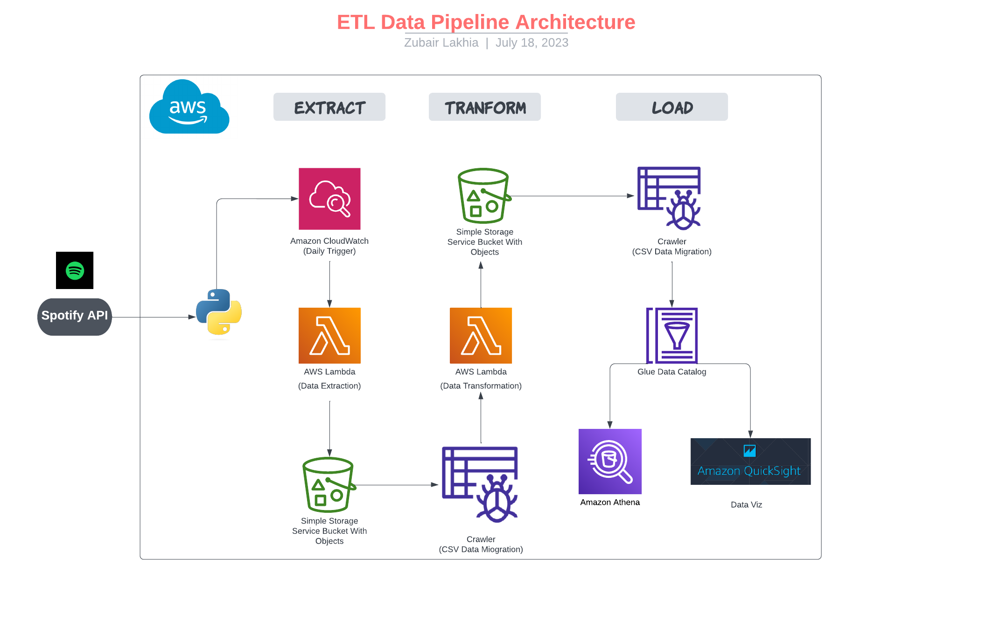

# Spotify_ETL_Pipeline with AWS
## Spotify Data Pipeline: Extract, Transform, Load, Analyze

Building a data pipeline using the Spotify API and AWS Services allows you to extract data from Spotify and process it efficiently. 
###### 

### Important Terms:

###### 

**Spotify API**: provides access to music-related data.   
**AWS Lambda**: Automation and execution of Python Script.  
**AWS S3 Buckets**: S3 buckets store the extracted data.   
**AWS Glue Crawlers**: used to analyze data, create Gluejobs, data integration, and data migration   
**AWS Athena/Quicksight**: used for querying and visualizing data

**The pipeline will integrate with the Spotify API to fetch relevant data and store it in an organized manner on AWS S3. The extraction process will be automated by deploying code on AWS Lambda, which will run at scheduled intervals or trigger events. Once the data is extracted, a transformation function will be implemented to clean and format the data for further analysis. This function will be designed to handle various data processing tasks, such as data normalization, aggregation, or filtering, based on specific requirements.**

**Once data was stored in S3 buckets, crawlers were used to parse the data. This ensured that all CSV files were converted into parquet files, and stored in another S3 bucket. Analytics, visualizations and querying were then done by AWS Quicksight and Athena.**

**Through the implementation of the Spotify data pipeline on AWS, the project endeavors to create a flexible and dependable solution for efficiently extracting, transforming, and analyzing Spotify data. By automating the entire process, it ensures seamless data flow, allowing users to gain valuable insights from the data for diverse analytical needs. The integration of AWS services empowers the pipeline to scale effortlessly as the data volume grows, providing a reliable and robust platform for handling Spotify data and unlocking its full potential for valuable business and research applications.**

